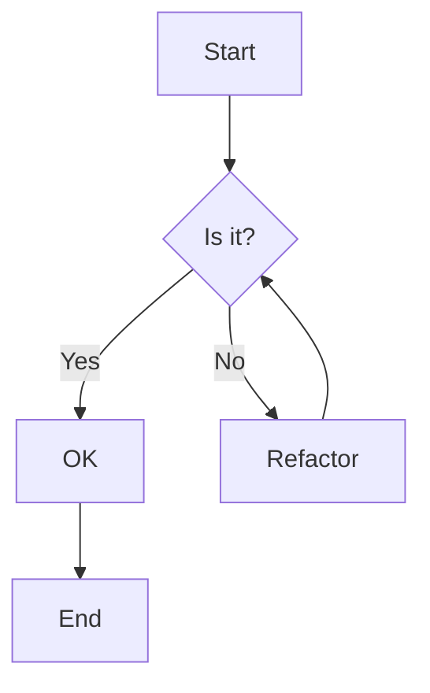

Here is a sample Mermaid diagram:

```mermaid
graph TD;
    A[Start] --> B{Is it?};
    B -- Yes --> C[OK];
    C --> D[End];
    B -- No --> E[Refactor];
    E --> B;
```

This should render as a flowchart. 